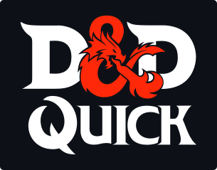

## Description

In D&D one of the most time consuming setup processes, and potential hurdles for people new to the D&D, is creating your character sheet. 
D&D Quick is a small web application that drastically simplifies this process by mostly automating the steps needed to correctly fill out a character sheet. 
It's developed with the primary goal of getting you ready for the table with just a few easy to understand clicks.

## Contributors
- [Connor Bishop](https://github.com/crypticsurfer)
- [Tim Morgan](https://github.com/tmorgan-dev)
- [Michael Miazza](https://github.com/FullStackCodingEngineer)
- [Jared Boehm](https://github.com/JaredBoehm)

## Usage

The end result can be viewed [here.](https://jaredboehm.github.io/dnd-quick/)

## License

NA