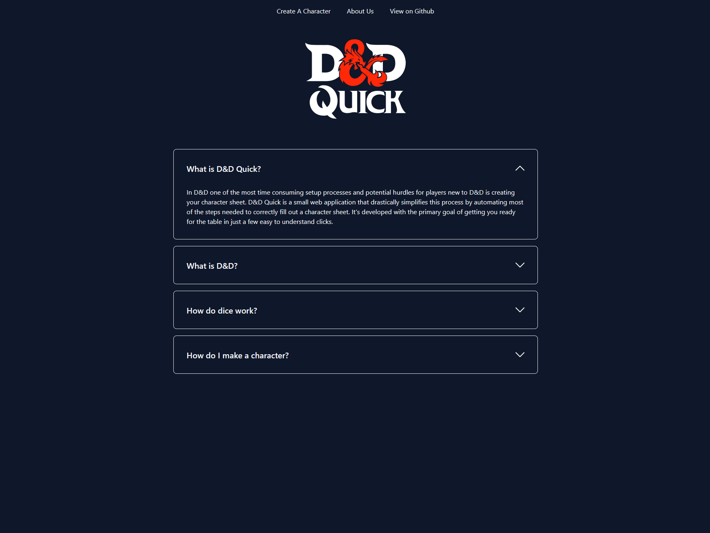
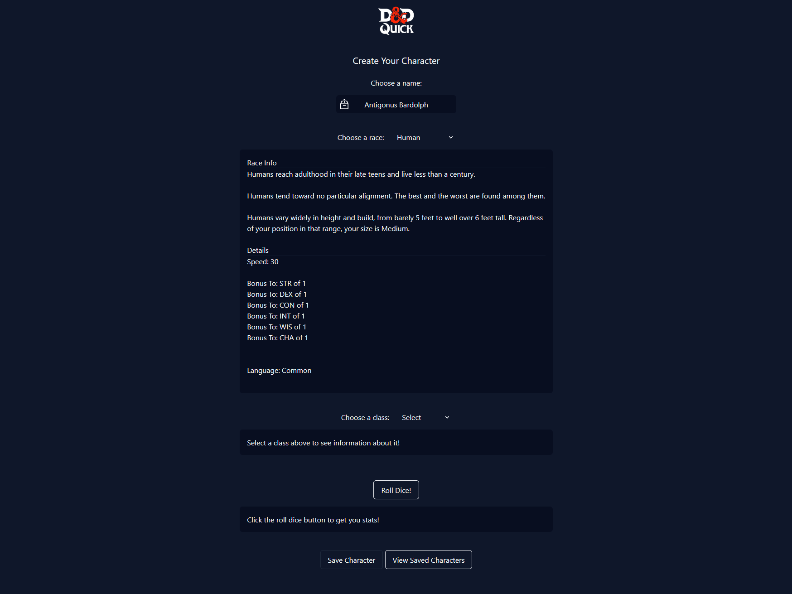
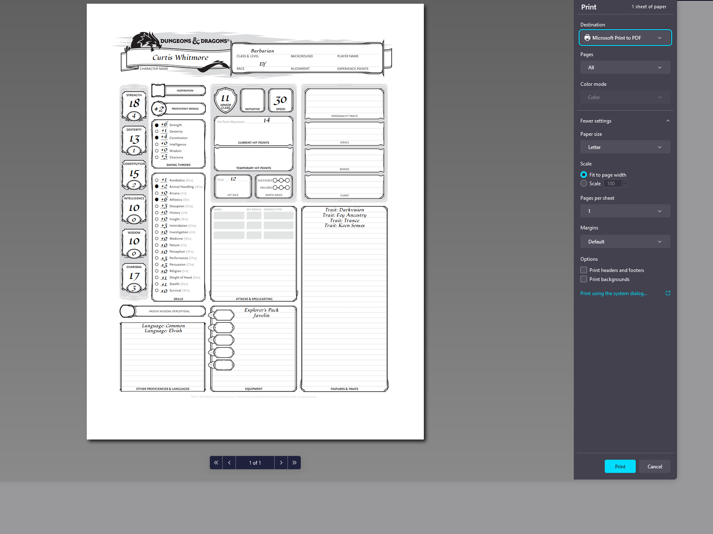

## Description

In D&D one of the most time consuming setup processes and potential hurdles for players new to D&D is creating your character sheet. 
D&D Quick is a small web application that drastically simplifies this process by automating most of the steps needed to correctly fill out a character sheet. 
It's developed with the primary goal of getting you ready for the table in just a few easy to understand clicks.

## Usage

Navigate to the following [URL](https://jaredboehm.github.io/dnd-quick/) to access the application. You can see a quick preview of it's features in the screenshots section [below](#screenshots).

Once on the landing page you can click the drop downs to learn more about the D&D and D&D Quick. When you're ready click *"Create Character"* and pick a name (or hit the random button!), then select your class and race, and finally *"Roll Dice"* to simulate the dice rolling process and generate random base stats for your character. You can save any created characters and then view them by clicking *"View Saved Characters"*, selecting a saved character will open up a print window where you can print an automatically generated standard character sheet based on your choices!

## Contributors
- [Connor Bishop](https://github.com/crypticsurfer)
- [Tim Morgan](https://github.com/tmorgan-dev)
- [Michael Miazza](https://github.com/FullStackCodingEngineer)
- [Jared Boehm](https://github.com/JaredBoehm)

## License

NA

## Screenshots

